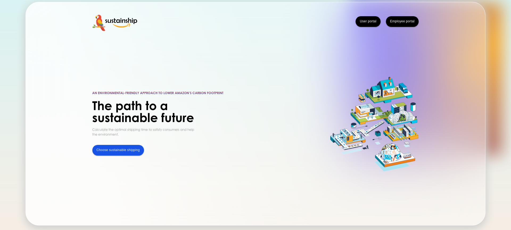

<h1 align="center">
  <br>
  
  <br>
  sustainship
  <br>
</h1>

<h4 align="center">An intuitive web interface to coordinate package shipments and reduce carbon emissions</h4>

<p align="center">
  <a href="#key-features">Key Features</a> •
  <a href="#how-to-use">How To Use</a> •
  <a href="#license">License</a>
</p>
    <div align="center">
  
    <label for="img"><i>Landing Page</i></label>
    </div>

## Key Features

* User and Employee Auth
* Delivery driver portal
    - Displays all information related to submitted orders and group shipments, including carbon emissions savings
    - Shipments filterable by postal code
* User portal
  - Shows all submitted orders with expected carbon emissions savings 
  - Orders filterable by date
  - Seamless submission form

## How To Use

To clone and run this application, you'll need [Git](https://git-scm.com) and [Node.js](https://nodejs.org/en/download/) (which comes with [npm](http://npmjs.com)) installed on your computer. From your command line:

```bash
# Clone this repository
$ git clone https://github.com/mslwang/sustainship.git

# Go into the backend directory in the repository and install dependencies
$ cd sustainship/backend 
$ npm install

# Store your mongodb uri into a .env file with env variable name MONGO_URI
$ echo MONGO_URI=`insert mongodb uri` > .env

# Go into the client directory and install dependencies
$ cd ../client
$ npm install

# Run the app
$ npm start
```

## Technologies

This software uses the following technologies:

- [Node.js](https://nodejs.org/)
- [Express](https://expressjs.com/)
- [React](https://reactjs.org/)
- [Material-UI](https://material-ui.com/)
- [MongoDB](https://www.mongodb.com/)

## License

MIT


